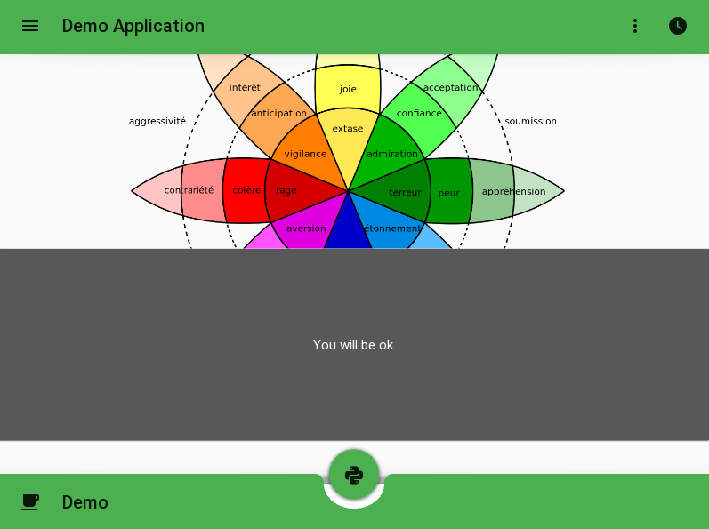
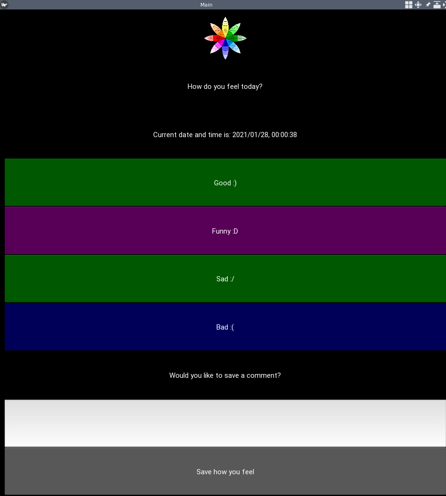

# Mobile App 

In this project we are trying to create an emotion app tracker

## Examples

Template one with header, footer and emotion wheel:

Template two with the date, feeling and comment sections:

## Tasks

1. Allow multiple emotion picking
1. Connect to database and save: date, emotion and comment
1. Display emotions on colored treemap
1. Trigger notification for daily tracking